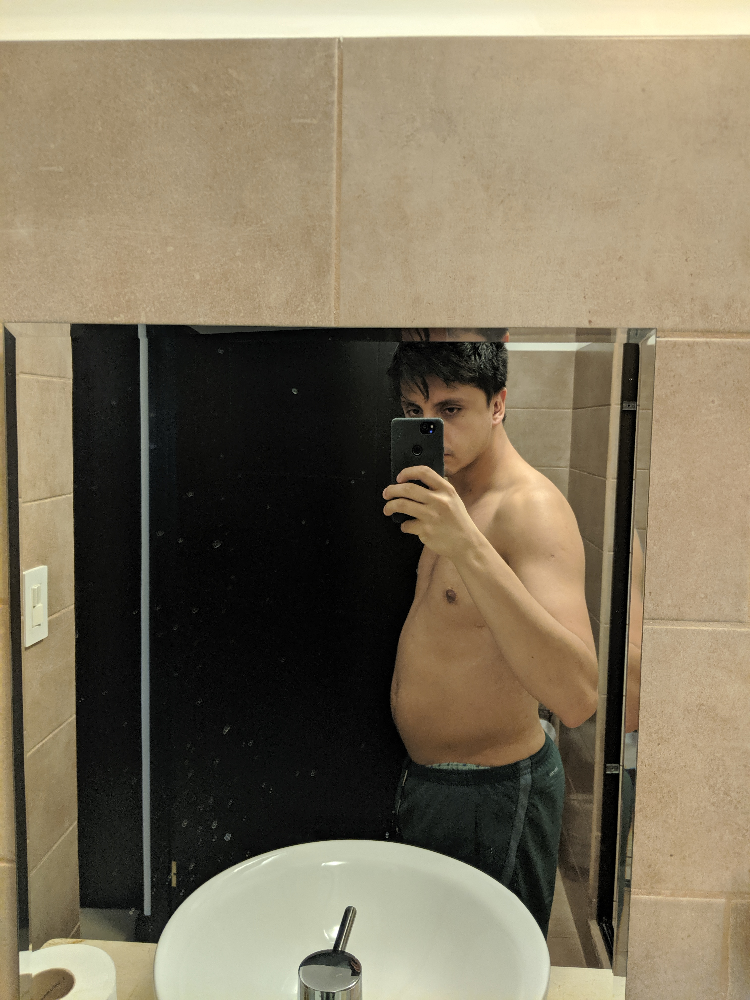

This post in just a reminder for myself to try something new. The past 3-4 years my lifestyle has worsened, which has affected how I look and how I feel about myself. This has been mostly because of my laziness and lack of willingness to work out.

When I was at high school, even though I was not in shape I remember that I weighed 132 pounds, which I believe those were my best years, I was so skinny 💔. Then at 2015 I started to work in a shitty company which I'm not going to name, which led to drink more and more energy drinks and eat a lot of snacks while having filthy lunch times that changed frequently. Then I quit to "focus in college" which I didn't, while continuing with bad habits of eating fast food and also drinking alcohol regularly. In the meantime I did two work and travel programas where my diet was pretty bad, I ate Burger King usually three times per week, and I'm not including the fast food in the restaurants that I worked. Then when I got here in Costa Rica I was a software apprentice without money that still mantained the old habits of drinking energy drinks(I love you monster) and eating fast food.

I did all of that shit without exercising regularly and avoiding the most basic healthy habits(drinking water for example) and this made me be as I am now. A skinny fat guy that is concerned about his health.

For me and I cannot speak from the rest, just from my point of view, I usually left everything lying, it is pretty hard for me to keep me in interested in something, excersising is one of those things. One of my goals with this post is to try to keep me interested and updating this will help to not throw the towel.

So in this post which I plan to release if everything goes right, I will display how I changed, yes showing pictures of my self and telling my journey. This is a WIP and I hope to have relevant results, I do not want to leave all of my vices but to see results I'm going to have to leave some(I'm talking to you fast food) and start working out frequently.

I'll be updating this per week, starting from sunday, and I'll tell you everything I did, it can be either good or bad things and let's see if I see some good results.

I downloaded _map my fitness app_ and I paid the monthly subscription because they design running workouts for you, based on your goals. I just set a goal to lose weight and first week seems fairly easy because I just have to run 1.55 miles which is nothing special, I just need to take the time and willingness to do it. Btw my routine is 4 days per week, which I believe is one of the hardest part because I'm a couch potato, but let's see how it goes.

Week 1 (06-16-2019 to 06-22-2019):

As you can see I look like a 40 year old dad with drinking problems and I do not look like I'm 23.

I started my first workout, everything went great, it was a pretty short distance and it was not hard at all. Tomorrow I'll start eating better and I will avoid any fast food at all.
